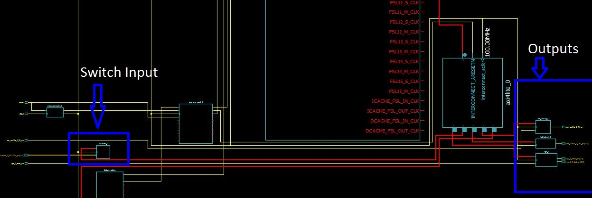

# Remote Terminal

This lab has two main sections: use of picoblaze and microblaze. The use of both these programs result in the same functionality. This functionality is the input of 3 character commands. When the commands swt or led are inputted then it will result in output of the switch values and input of 2 hexidecimal digits to output the respective led value.

## PicoBlaze
PicoBlaze implementation invovled more work within the ISE Project Navigator, which is what we have been using. This was completed by using the openPICIDE program then converting the .psm file to a .vhd. Once this was completed then components and signals were connected in the ISE Project Navigator. The biggest issue I had with the PicoBlaze was the initial attempt to echo back a character. This was fixed by hooking up the opposite data present signals to the uart components, i.e: for the tx: `buffer_write => uart_rx_data_present,` and for rx: `buffer_read => uart_tx_data_present,`. This issue was also fixed by creating a valid test bench. After this step was complete then it was just comprehending what was in the datasheet and adding it in/changing it when needed. One example of this is the final read and write buffers.

```
read_from_uart_rx <= '1' when (read_strobe = '1') and (port_id = x"AF") else
	'0';
write_to_uart_tx <= '1' when (write_strobe = '1') and (port_id = x"AF") else
	'0';
```

One of the biggest takeaways from this portion was being able to read documentation files in order to figure out how to implement different functions that are already given.

## MicroBlaze

The following is a representation of how the components are connected in MicroBlaze.



This portion was a lot similar to how we programmed in 382, so in my opinion it was easier. This however, took much longer to build a bit stream, so you always hope your hardware code in Xilinx works the first time. Once in the SDK program it was a lot easier to code the FPGA to do what you want. Coding in C was a lot easier for this project than it was to code in VHDL due to the sequential logic used. The big issues I ran into were the output to the LEDs and reading values from the switches. After reading through the `xil_io.h` file I found a `Xil_Out8(Address, value)` function that used 8 bits instead of the `Xil_Out32(Address, value)` that was used in the tutorial. Once this function was used, my LEDs worked! The switches took a little more figuring out. I ended up googeling "how to input peripherals using microblaze". This resulted in finding that I needed to change the values of the slave registers within the `user_logic.vhd`. This was done with the following code:
```
    case slv_reg_read_sel is
	  when "10000000" => slv_ip2bus_data <= slv_reg0(C_SLV_DWIDTH-1 downto 8) & SWITCH;
	  when "01000000" => slv_ip2bus_data <= slv_reg1(C_SLV_DWIDTH-1 downto 8) & SWITCH;
	  when "00100000" => slv_ip2bus_data <= slv_reg2(C_SLV_DWIDTH-1 downto 8) & SWITCH;
	  when "00010000" => slv_ip2bus_data <= slv_reg3(C_SLV_DWIDTH-1 downto 8) & SWITCH;
	  when "00001000" => slv_ip2bus_data <= slv_reg4(C_SLV_DWIDTH-1 downto 8) & SWITCH;
	  when "00000100" => slv_ip2bus_data <= slv_reg5(C_SLV_DWIDTH-1 downto 8) & SWITCH;
	  when "00000010" => slv_ip2bus_data <= slv_reg6(C_SLV_DWIDTH-1 downto 8) & SWITCH;
	  when "00000001" => slv_ip2bus_data <= slv_reg7(C_SLV_DWIDTH-1 downto 8) & SWITCH;
	  when others => slv_ip2bus_data <= (others => '0');
    end case;
```
Using this along with the `Xil_In8(Address)` function allowed me to successfully read in the switch values.


## Test/Debug

The testing used for the PicoBlaze included using the testbench for the initial checking of the connection of the UART modules and debug mode within openPICIDE. The MicroBlaze was strictly trail and error. The process of trail and error takes a lot of time and is not the most efficient way to test. However, I couldn't test and debug within the SDK due to having to use the UART plug in, which lost connection between the FPGA and SDK, so trial and error was my only option. My debugging issues were discussed in the two sections above.

## Conclusion

Overall I learned how to use UART for a FPGA. The biggest takeaway from this lab was how to read through a Datasheet and process how the different components work, in order to successfully program on your own. This was essential in the intial UART connections, use of peripherals in MicroBlaze, and the functions to interact with those peripherals within the SDK Program. If I were to do this lab over again, I would try to fully get the VGA functionality. I attempted it, but didn't fully get it. One help with that functionality would be to go over how to interface peripherals with .vhd files that you already have.
